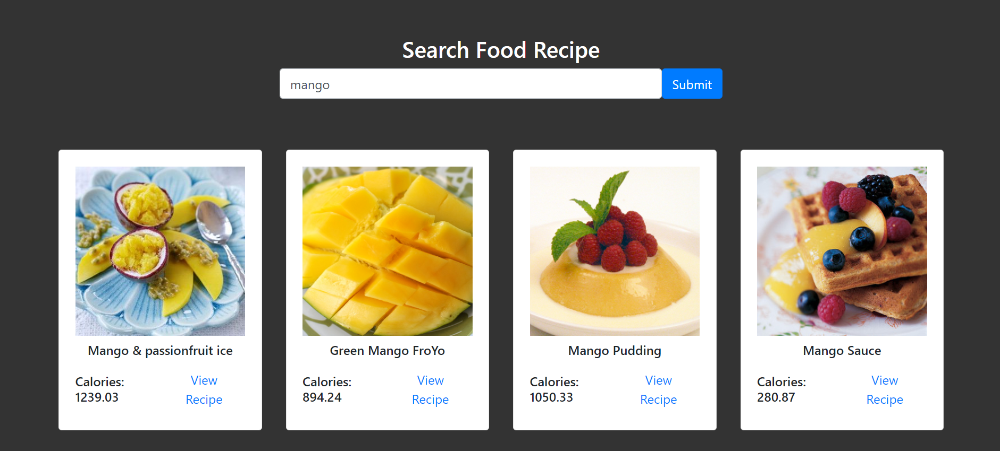

# Tasty-Treats

## Tasty-Treats : *A recipe finder website*

Search for a recipe by entering a keyword ;

💠 *Search results include name of recipe, its image, calorie count and link to view recipe*

 A live image gallery website using simple
 * HTML 
 * Bootstrap 
 * JAVASCRIPT
 * EDAMAM API
 
 
 ⭐ Learnt how to fetch public APIs in JavaScript using async and await functions.
 
 ⭐ Learnt how to use Javascript to develop dynamic HTML code.
 
 ⭐ Learnt how to find recipe instructions on query.
 
 
 We are fetching data from (https://developer.edamam.com/edamam-docs-recipe-api).

✔️ Deployment on github, link :
(https://jasweenbrar.github.io/Tasty-Treats/)

✔️ Our website looks like :

